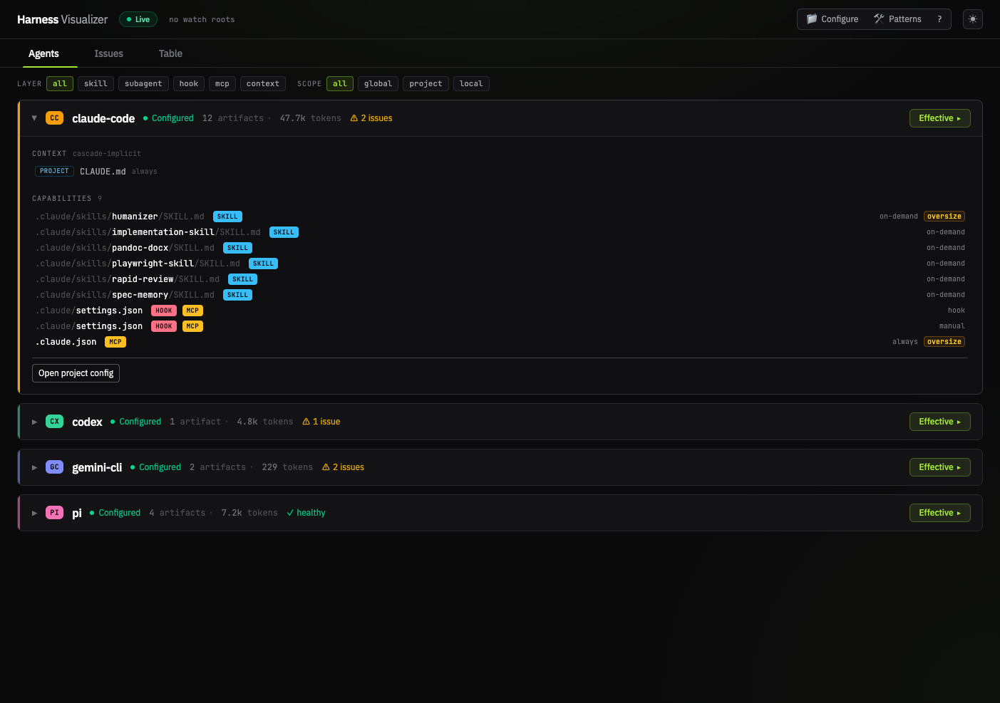
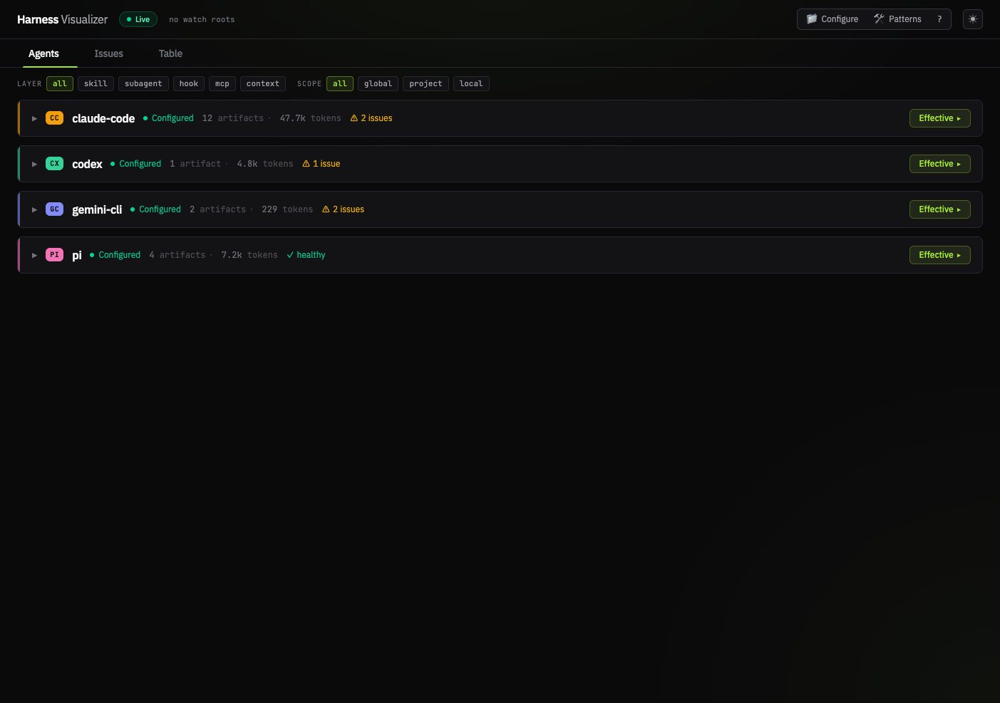
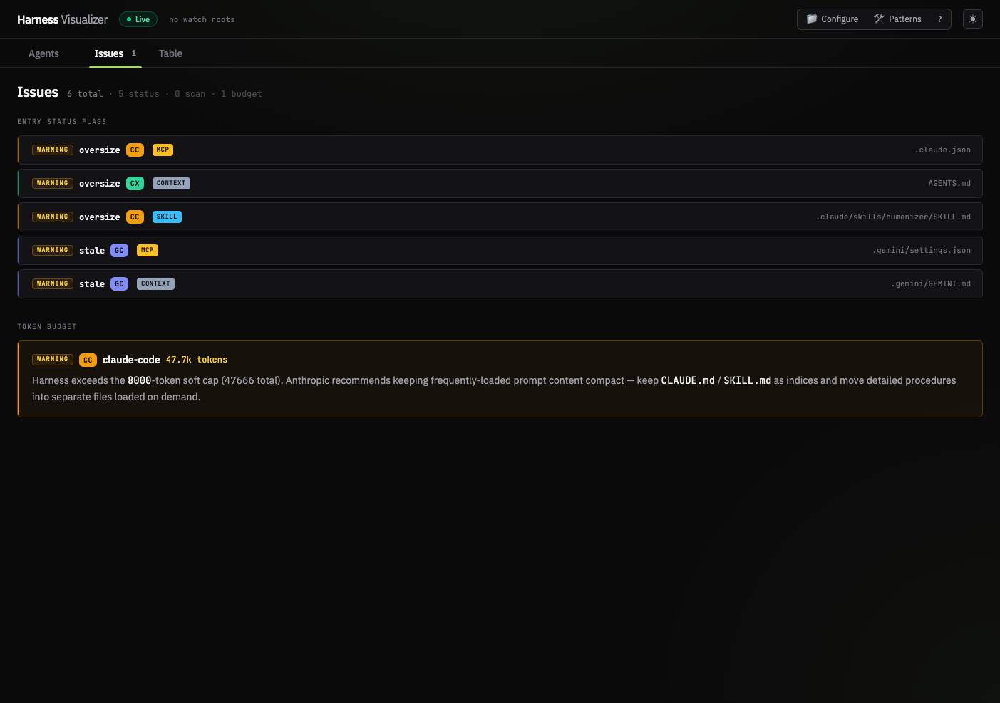
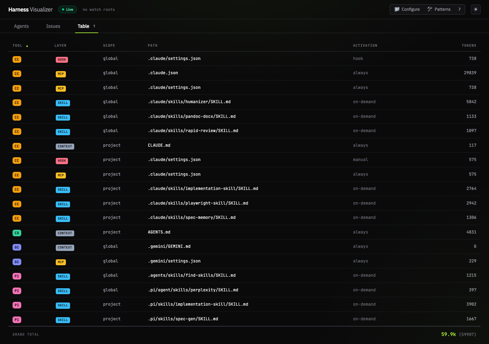

# Stop Using One AI Tool for Everything
**Will Marple — VueConf 2026 · Black Airplane**

> A talk about escaping vendor lock-in, owning what your AI agents produce, and building a runtime-agnostic harness that travels across Claude Code, GitHub Copilot, and any model.

---

> I created a fork of this repo so I could deploy the slides to GitHub Pages. The hosted version of Will's presentation can be found at:
> 
> [https://calebm1987.github.io/vue-conf-26-slides/](https://calebm1987.github.io/vue-conf-26-slides/)
> 
> And his original repo is here:
> 
> [https://github.com/willmarple/vue-conf-26-slides](https://github.com/willmarple/vue-conf-26-slides) 
>
> *Note: A summary of the slides is included below, but I highly recommend checking out the full presentation for all the details and context.*
---

## The Core Problem: We're All Vendor-Locked

The talk opened with a confession: in November the talk was going to be a multi-tool pipeline:

```
Figma MCP  →  Gemini (design extraction)  →  Claude (implementation)
```

By conference day, a single model with a 1M context window did all three steps. *"A lot happens in AI in six months."*

The real problem isn't which tool you pick — it's that you've probably picked **one** and built your whole workflow around it. When that model or tool changes (and it will), you're exposed.

---

## The New Skill: The Layer You Build Around the Model

> "AI can write code now. Your previous skill is still relevant, but there's a new skill in the **layer you build** around out-of-the-box AI agent capabilities."

The audio metaphor that frames the whole talk:

> **"The art of live sound is the art of turning things *down*."**

AI just turned the volume up on every developer. The skill is now building your own mixing board — your **harness**.

---

## Two Ways to Fail (And Their Names)

| Mode | Name | Cost |
|---|---|---|
| Read every line of AI output | **Velocity debt** | You can't ship fast enough |
| Read nothing | **Comprehension debt** | You can't own what you shipped |

> "One feels responsible. The other feels irresponsible. Neither is viable or scalable."

Both compound. The talk is about escaping this dichotomy.

**The thesis:**
> *"Agentic engineering isn't about how much code you can produce. It's about how much you can **responsibly own**."*

---

## Engineer Your Own Harness

> "The system you build that builds the system."

A harness has **four levers** plus a closing loop:

| # | Lever | What it is |
|---|---|---|
| 01 | **Prompting** | the instruction |
| 02 | **Context** | the working set |
| 03 | **Memory** | what persists |
| 04 | **Tools** | what it can do |
| ↺ | **Evaluation** | closes the system — verifies output against the spec |

### The floor is level. The harness is your edge.

Out of the box, every developer gets the same models (GPT-5, Claude Opus 4.7, Gemini 3). Same APIs. Same median output per token. **The floor is level.**

Your harness is what you build above it:
- **Pulls the median up** — context, memory, tools, eval tuned to *this* project
- **Living and breathing** — every rep, every review, every spec makes it sharper
- **Uniquely yours** — your experience, your judgment, your defaults, infused into the process

> *"The model is a commodity. The harness is you."*

---

## What a Harness Looks Like on Disk

The harness isn't magic — it's just files:

```
harness-visualizer/
├── AGENTS.md              # context · canonical
├── CLAUDE.md              # context · alias
├── ROADMAP.md             # memory · progress
├── .review/               # memory · audit trail
└── .claude/
    ├── settings.json      # hooks
    ├── skills/
    │   ├── playwright-skill/      # tools · eval
    │   └── implementation-skill/  # tools
    └── plugins/
        ├── spec-gen/      # context · multi-agent
        └── claude-build/  # tools · eval
```

> "Files on disk. Nothing magic. **You can see all of it.**"

### Harness Visualizer Demo

The demo vehicle was **harness-visualizer** — a Vue 3 app that reads a project's harness and surfaces it as a visual dashboard. The repo for this project can be found here:

[https://github.com/willmarple/harness-visualizer](https://github.com/willmarple/harness-visualizer)

> Note: if you clone this repo and try to run the visualizer, it may throw an error saying it can't find the `@harness-visulizer/shared` package. This is because that package is a local dependency that's not published to npm and therefore requires the `dist` folder to be built locally. To get around this, run the following commands from the root directory:
>
> ```bash
> cd shared
> npm run build
> # Then go back to the root and run the visualizer
> cd ..
> npm run dev
> ```




**Three views into the same data:**


*Agents view: per-tool cascade, token totals, configured artifacts, flagged issues*


*Issues view: oversize files, stale entries, token budget warnings*


*Table view: sortable inventory of every artifact, scope, path, activation, token count*

> Note: 

---

## Lever 02: Context

Context isn't everything an agent *could* know — it's what loads *right now*.

### AGENTS.md — The Project Constitution

One file every agent reads first, regardless of tool. Tool-agnostic: Claude reads it, Cursor reads it, Copilot reads it. When it changes, the project's posture changes.

**What goes inside:**
- What this project is (scope, audience)
- Stack (packages + roles)
- Repo layout (tree, ownership)
- Harness layer taxonomy
- Diagnostic codes (severity map)
- **Security rules** (non-negotiable)
- Conventions (TS · Vue · backend)
- Quality gates (typecheck · lint · test)
- Spec workflow
- Roadmap phase status
- Out of scope (deliberate non-goals)
- Working agreement (how agents behave)

### Progressive Disclosure — One File Isn't Always Enough

```
backend/docs/conventions/
├── patterns/    # HOW we build (reusable idioms)
└── features/    # WHAT we ship (domain capabilities)

frontend/docs/conventions/
├── patterns/
└── features/

shared/docs/conventions/
└── patterns/
```

Agents only load what's relevant to *where they're working*.

### Photo-Accurate Docs (Not Generic Templates)

| Generic Template | Generated from Real Evidence |
|---|---|
| "Vue 3 components should use the Composition API. Use Pinia for state management..." | `## Pattern` / Routes wrap handlers in `safeAsync()`. / `## Evidence` / `backend/src/routes/scanner.ts:42` |
| Could apply to any project. Cites nothing. | You can navigate to where the rule lives. |

> "No invented patterns. **If it's in the doc, it's in the code.**"

### The Docs Author Themselves (Three Phases)

```
01 discover  →  02 scaffold  →  03 author
(heuristic,     (filesystem,    (parallel LLM
 no LLM)         idempotent)     worker pool)
```

- Re-runnable, idempotent
- Symbol-level anchors
- HIGH / MEDIUM / LOW staleness bands

When code changes, re-run. **The docs catch up to the code.**

### The Spec Pipeline

Parallel research fans in, one agent runs the pipeline:

```
[research-lead + integration-researcher + codebase-explorer]
               ↓
01 discovery → 02 requirements → 03 design → 04 tasks
```

**The spec is the comprehension contract:**
- `Plan` creates the spec (the artifact you understand)
- `Implement` generates code against the spec
- `Eval` verifies the code matches the spec

> "You comprehend the spec. **The code, you verify.**"

### Cross-Vendor Portability

The spec pipeline runs in two implementations:

| Tool | Implementation | Capability |
|---|---|---|
| Claude Code | plugin · 4 agents | ✓ multi-agent orchestration |
| pi.dev / GitHub Copilot | skill · 1 agent | single agent, sequential |

**Same pipeline. Same artifacts. Multi-agent is a capability — not the pattern.**

---

## Lever 03: Memory

Three substrates, three questions the next agent can answer without you:

| Substrate | Question | Contents |
|---|---|---|
| `.review/` | What changed and why | RRL artifacts, typed, timestamped, risk-classified |
| `specs/` | What we agreed to | Per-phase spec bundles |
| `state.json` | Where we are | Multi-phase workflow checkpoints |

### The Audit Trail

Every meaningful turn leaves a structured artifact in `.review/`:

```yaml
---
type: IMPLEMENTATION
timestamp: 2026-05-17T20:40:00Z
risk_level: MEDIUM
files_changed: 7
decision_count: 3
---

## 30-Second Summary
...

## High-Risk Segments
⚠️ scanner.ts:142–168
   Risk: LOGIC

## Decision Log
DEC-014 [EXPLICIT] ...
```

### Memory Is Searchable

> "The agent remembers the project, not just the conversation."

No vector store needed. The implementation is SQLite FTS5:

```sql
-- FTS5 mirror, trigger-synced on every write
CREATE VIRTUAL TABLE chunks_fts USING fts5(...);

-- agent retrieval, on demand
SELECT spec_name FROM chunks_fts
  WHERE chunks_fts MATCH 'scope-aware AND scanner';
```

> "No vectors. No fine-tune. Structured artifacts and full-text search."

---

## Lever 04: Tools

### The Tool Inventory

**Skills** (single-purpose, cross-vendor):
- `playwright-skill` — Real-browser drive; snapshot, click, fill, capture console + network
- `implementation-skill` — Single-agent execute against a tasks-doc spec

**Plugins** (multi-agent orchestrations, Claude Code):
- `spec-gen` — Plan: discovery → requirements → design → tasks (4 agents)
- `claude-build` — Implement: orchestrator + waves of implementers (5 agents)
- `claude-qa` — Validate: test-strategist + test-generator + qa-auditor + regression-tracker + mutation-analyst (5 agents)

### Plan → Implement → Validate

**`spec-gen` (Plan):** Parallel research fans out (4 subagents), produces a spec bundle: `discovery.md` · `research-briefs.md` · `requirements.md` · `design.md` · `tasks.md`

**`claude-build` (Implement):** Three-wave model:
- **Wave 0** — 1× implementer sets contracts (types, interfaces, module boundaries). Nothing else moves yet.
- **Wave 1** — 3× implementers work in parallel. Can't collide because Wave 0 drew the lines.
- **Wave 2** — 1× implementer stitches + architect-reviewer reads diff against design intent + test-writer covers new surface.

> "Wave 0 sets the contracts. Wave 1 can't collide. Wave 2 verifies."

**`claude-qa` (Validate):** When a spec is in scope, `qa-auditor` verifies the implementation against `design.md`, every *must-have* requirement is exercised, and tests trace back to the requirements that demanded them.

### When to Go Multi-Agent vs. Stay Single

**Go multi-agent when:**
- Independent lanes (no shared files, clean boundaries)
- Coverage beats depth (many shallow passes — research, tests, audits)
- You're the bottleneck (delegate, then review)
- Interfaces are already clear (contracts let agents work without colliding)

**Stay single-agent when:**
- The work is sequential (each step depends on the last)
- You're still shaping the problem (vague reqs, exploration, design talk)
- It's a small, local change (one PR's worth — overhead won't pay off)
- Needs creative coherence (one mind, end-to-end)

> "When in doubt, **start single**. Add agents when the bottleneck moves to you."

### The Transferable Pattern for Every Custom Tool

```
agent  →(call)→  skill (200-token summary)  ←(stores)→  cache (full state on disk)
                                ↑
                   query by name, on demand
```

> "Compress for the agent. **Expand on demand.** That's how you build tools that don't blow the context window."

### Hooks — The Automatic Harness

```json
{
  "hooks": {
    "PostToolUse": ["rapid-review"],
    "Stop":        ["rapid-review-mark"]
  }
}
```

- Every tool call → artifact in `.review/`
- Every session-end → commit-ready marker

> "Hooks make the harness write its own audit trail. **I don't have to remember.**"

---

## Lever 05: Evaluation — Read Closely Where It Matters

> "Not all AI-generated code deserves equal attention."

| Risk Level | Category | Examples |
|---|---|---|
| 01 · LOW | Boilerplate | DTOs · getters · fixtures · scaffolding |
| 02 · MED | Logic | Business rules · conditionals · transformations |
| 03 · HIGH | Blast radius | Auth · credentials · external APIs · payments |
| 04 · CRIT | Irreversible | DROP/TRUNCATE · destructive migrations · infra |

> "BOILERPLATE — scan, sign off. LOGIC — read, but trust your tests. BLAST RADIUS — read every line. IRREVERSIBLE — read every line twice, and re-read after the agent runs."

**This is the frame the architect-reviewer subagent uses. This is the frame your reviewers should use.**

---

## Cross-Vendor Demo: Same Skill, Two Runtimes

The live demo ran the same `playwright-skill` against `harness-visualizer` in:
1. **Claude Code + Opus 4.7** — browsed the app, opened accordion, navigated tabs, used table view
2. **pi.dev + GPT-5.5** — opened markdown, edited, saved, re-rendered

> "Two vendors. One harness. **Same skill, written once.**"

---

## The Close: Escaping the Dichotomy

> "You didn't read every line. You also didn't ship dark code."
> **That's the dichotomy escape.**

The comprehension contract is how you get there:

```
Plan  →(creates)→  SPEC (the artifact you understand)  ←(verifies against)←  Eval
                          ↑
               Implement generates code against the spec
```

---

## Beyond the Coding Harness

- **Warp Terminal** — AI-native shell for ops, scripts, one-off pipelines
- **Wispr Flow** — Voice dictation, think faster than you type
- **Perplexity / Sonar API** — Give your agent a "Stack Overflow": when the agent gets stuck on stale training data or a new API, it calls the Sonar API, gets current web knowledge with citations, and unblocks itself

---

## What's in the Box (harness-visualizer)

Fork the repo and you get:

| Type | Name | What it does |
|---|---|---|
| SKILL | `playwright-skill` | Real-browser QA + demos. Cross-vendor. |
| SKILL | `implementation-skill` | Single-agent execute. Cross-vendor. |
| PLUGIN (4 agents) | `spec-gen` | Plan: discovery → requirements → design → tasks |
| PLUGIN (5 agents) | `claude-build` | Implement: 5 agents in 3 waves |
| PLUGIN (5 agents) | `claude-qa` | Validate: 5 auditors, anchored to the spec |

Plus: auto-authored progressive-disclosure convention docs for `backend/`, `frontend/`, and `shared/` — generated from real path:line evidence.

> **"Don't wait for the perfect tool. Build the harness for the next feature, today."**

---

## Relevance for Our Team

This is directly applicable to what we want to do. The key insight for **runtime-agnostic harnesses** from the talk:

1. **The methodology is vendor-portable; the capabilities aren't.** The spec-gen pipeline, for example, runs as a 4-agent Claude Code plugin *or* as a single sequential agent in another runtime. Same artifacts, same workflow, different execution model.

2. **`AGENTS.md` is the tool-agnostic anchor.** Claude Code reads it, GitHub Copilot reads it, Cursor reads it. It's just a Markdown file — no tool-specific syntax. This is the foundation for portability.

3. **Skills (bin scripts) are the cross-vendor primitive.** `playwright-skill` was demonstrated live in both Claude Code and pi.dev without modification. A skill is just shell scripts — any runtime that can call a subprocess can use it.

4. **Multi-agent orchestration is a capability, not the pattern.** If Claude Code is available, you get parallel agents. If you're using Copilot or another single-agent runtime, you get the same pipeline sequentially. The harness adapts; you don't rewrite it.

5. **The audit trail (`.review/`, hooks) is harness behavior, not model behavior.** Hooks in Claude Code auto-generate review artifacts. In a Copilot workflow, you trigger the same review script manually or via a CI step. Same data, different trigger.

**Bottom line:** Start with `AGENTS.md` as your single source of truth, build skills as composable shell scripts, define your spec workflow as a pipeline of Markdown artifacts, and layer in multi-agent orchestration where your runtime supports it. The core is runtime-agnostic by design.
